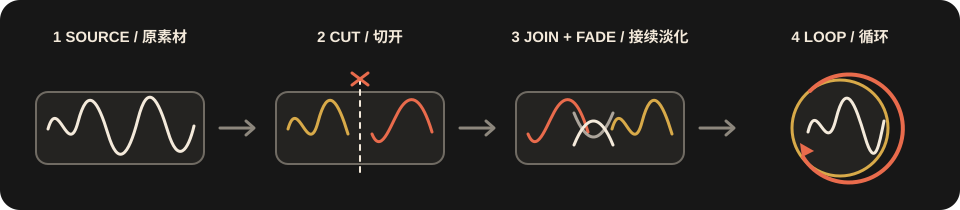
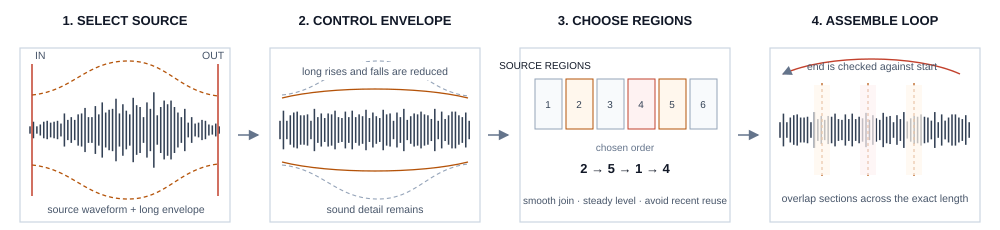

# loopy

[English](README.md) | [简体中文](README.zh-CN.md)

**Build seamless, exact-length loops from recorded sound.**

loopy is a JUCE audio plug-in for sound designers working with ambience, machinery,
weather, room tone and other continuous recordings. Load or record audio, isolate the
useful material, set the required duration, then generate a loop for audition, WAV export
or drag-and-drop into a DAW.

## Two modes

| | LOOP | TEXTURE |
| --- | --- | --- |
| Purpose | Turn the standard manual loop-editing process into a one-click workflow | Turn texture captured from non-loop-ready material into a continuous loop |
| Starting material | Audio already suitable for conventional loop editing | Audio that contains useful texture but does not naturally form a loop |
| Method | Cut and rearrange the source, crossfade the relocated head-to-tail join, then check the result automatically | Extract source-derived texture, control its envelope and assemble compatible regions into a circular result |
| Output length | Any exact duration: shorter, equal or longer than the selected source | Any exact duration |

`LOOP` automates the familiar manual workflow: cut inside the material, swap the two
sections so the original head-to-tail boundary moves into the middle, and build the fade-in
and fade-out around that join. It adds automatic boundary checks, candidate selection and
exact duration control. Shorter targets are selected from the source; longer targets repeat
a completed base loop to the requested length.

`TEXTURE` handles material that is not naturally suited to that workflow. It captures usable
texture from the selected recording, reduces obstructive macro envelope and pass-by motion,
and assembles compatible source regions into a continuous circular result. The output keeps
the character of the recording while turning its texture into a usable loop.

## How it works

### LOOP

loopy searches ranges at the requested length and compares waveform, level, phase and stereo
continuity at possible joins. It chooses an internal cut, moves the old end-to-start join into
the middle for crossfading, then extends the completed base loop to the exact target length.

### TEXTURE

loopy first reduces slow rises and falls, then divides the selection into overlapping regions.
It repeatedly chooses a region that joins smoothly, has stable level and was not just used,
then wraps the overlaps through the output end; optional Crush and Character processing follow.

## Features

- Exact user-defined duration in both modes.
- Boundary analysis using waveform, phase, level, spectrum, transient and stereo
  continuity measurements.
- Linked stereo traversal and processing.
- WAV, AIFF, FLAC and OGG input.
- 24-bit WAV export and drag-to-DAW delivery.
- Generated audio stored with the DAW project state.
- DC/non-finite cleanup and a `-1 dBTP` true-peak ceiling.

## Workflow

1. Load a recording or capture the plug-in input.
2. Set **Source In** and **Source Out** around useful material.
3. Choose **LOOP** or **TEXTURE**.
4. Set the required output length and adjust the mode controls.
5. Generate and audition several complete repetitions.
6. Save a WAV or drag the result into the DAW.

## Controls

| LOOP | Purpose |
| --- | --- |
| Final Length | Use the selection or enter any exact output duration |
| Seam | Set the maximum boundary crossfade |
| Audition | Blend source and generated monitoring |
| Loop Start / Join Position | Move the loop boundary |
| Options A-C | Choose among analysed cycle candidates |

| TEXTURE | Purpose |
| --- | --- |
| Length | Set the exact output duration |
| Stability | Reduce broad source-envelope movement |
| Crush | Reduce smaller repeated amplitude pulses |
| Transform | Control departure from the original timeline |
| Flow / Drift / Fracture | Choose traversal scale and continuity |
| Patina / Bloom / Fray | Apply optional downstream character |

## Installation

The distributed Windows package contains the complete `loopy.vst3` plug-in bundle.

1. Close the DAW.
2. Copy the complete `loopy.vst3` folder to `C:\Program Files\Common Files\VST3\`.
3. Open the DAW and rescan VST3 plug-ins.

Keep the bundle intact; copying only the binary inside it will not install the plug-in
correctly.

## Repository

- `plugin/Source/` — analysis, DSP, state and JUCE interface
- `plugin/Tests/` — deterministic engine tests
- `docs/` — algorithms, architecture and host-test guidance
- `plugin/Assets/` — bundled Space Grotesk fonts and license

## License

No project-wide source-code license has been granted. JUCE is dual-licensed; confirm the
applicable JUCE terms before distribution. Space Grotesk is included under the SIL Open
Font License in `plugin/Assets/SpaceGrotesk-OFL.txt`.
